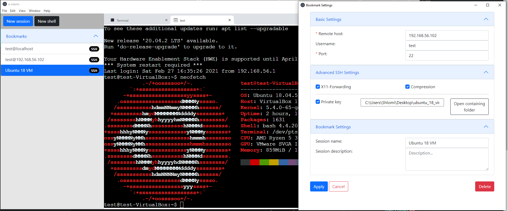
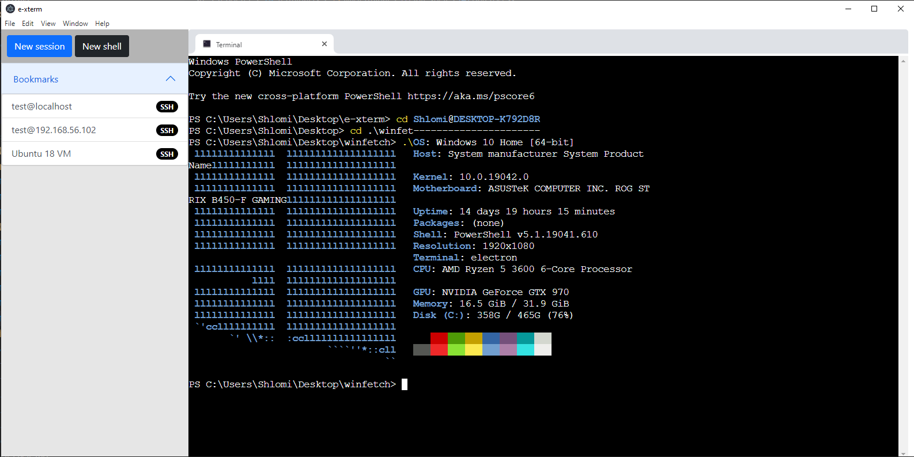

# e-xterm
Cross-platform (Windows, Mac, Linux) electron based SSH client, with managed bookmarks, and tab system for managing sessions. 

And most exciting for me is SFTP browser support - which you can drag and drop files and view remote files while SSH into it.

And lastly, remote monitoring tools, such as CPU %, RAM %, DISK %, all in one package.

Supported terminals for windows: **CMD, Powershell**

Supported terminals for linux: **Bash, ZSH, and more**

Note: This project is in the very early stages.

# Screenshots





## How to run
```
$ npm start
```

## How to download submodules in third-party directory

`$ git clone --recursive https://github.com/ShlomiRex/e-xterm`

If you have problems with node-pty NODE_MODULE_VERSION, then run:
`$ .\node_modules\.bin\electron-rebuild`
to fix the errors.
